# f290_acf_navegacao_e_temas

Para este projeto iremos realizar a navegação entre páginas e a confecção de temas de que se adeques aos temas claos e escuros; com base no `Material Design`.

> O Material Design é um padrão de Design ou Design System criado pelo Google para padrnizar aplicativos Android fornecendo aos desenvolvedores e Designers uma plataforma base para simplificar o processo de desenvolvimento e prover uma experiencia compartilhada entre aplicativos de diferentes fornecedores que utilizassem o Design System Material Design.

## Temas

Para este tutorial iremos utilizar os temas `Light` e `Dark` do Material Design. Você pode encontrar mais informações os temas Material Design neste [link](https://m2.material.io/design/material-theming/overview.html).

Para o tema escuro você pode buscar mais neste [link](https://m2.material.io/design/color/dark-theme.html).

## Criação de Projeto

1. Crie um novo projeto `f290_acf_navegacao_e_temas` e remova o código do arquivo `main.dart` e adicione à página inicial do MaterialApp um novo widget que será a página principal.

```dart
mport 'package:flutter/material.dart';

void main() {
  runApp(const MyApp());
}

class MyApp extends StatelessWidget {
  const MyApp({super.key});

  @override
  Widget build(BuildContext context) {
    return MaterialApp(
      theme: ThemeData(primarySwatch: Colors.red),
      debugShowCheckedModeBanner: false,
      title: 'Navigation and Themes',
      home: HomePage(),
    );
  }
}
```

2. Crie um novo arquivo no diretório `pages/home/home_page.dart`. Este arquivo conterá o `Scaffold` com uma `bottomNavigation` configurada e um `drawer` também.

> O BottomNavigationBar é um componente de nagegação semelhante `TabBar` porém, a barra de navegação na base está sempre visível ao usuário tornando a navegação mais intuitiva. Ela é uma propriedade do Scaffold também.

```dart
import 'package:flutter/material.dart';

class HomePage extends StatefulWidget {
  const HomePage({super.key});

  @override
  State<HomePage> createState() => _HomePageState();
}

class _HomePageState extends State<HomePage> {
  final url =
        'https://images.pexels.com/photos/1674752/pexels-photo-1674752.jpeg?auto=compress&cs=tinysrgb&w=1260&h=750&dpr=2';

  int _selectedIndex = 0;

  @override
  Widget build(BuildContext context) {
    return Scaffold(
      appBar: AppBar(
        title: const Text('Theme Example'),
      ),
      drawer: SafeArea(
        child: Drawer(
            child: ListView(
          children: [
            const UserAccountsDrawerHeader(
              currentAccountPicture:
                  CircleAvatar(backgroundImage: NetworkImage(url)),
              accountName: Text('Aluno Fatec Araras'),
              accountEmail: Text('aluno@fatec.sp.gov.br'),
            ),
            ListTile(
              onTap: () {},
              leading: Icon(Icons.exit_to_app),
              title: Text('Logout'),
            )
          ],
        )),
      ),
      body: const Center(
        child: Text('Body'),
      ),
      bottomNavigationBar: BottomNavigationBar(        
        currentIndex: _selectedIndex,
        items: const [
          BottomNavigationBarItem(
            icon: Icon(Icons.list),
            label: 'Feed',
          ),
          BottomNavigationBarItem(
            icon: Icon(Icons.favorite),
            label: 'Favorites',
          ),
          BottomNavigationBarItem(
            icon: Icon(Icons.account_box),
            label: 'Profile',
          ),
        ],
      ),
    );
  }
}

```

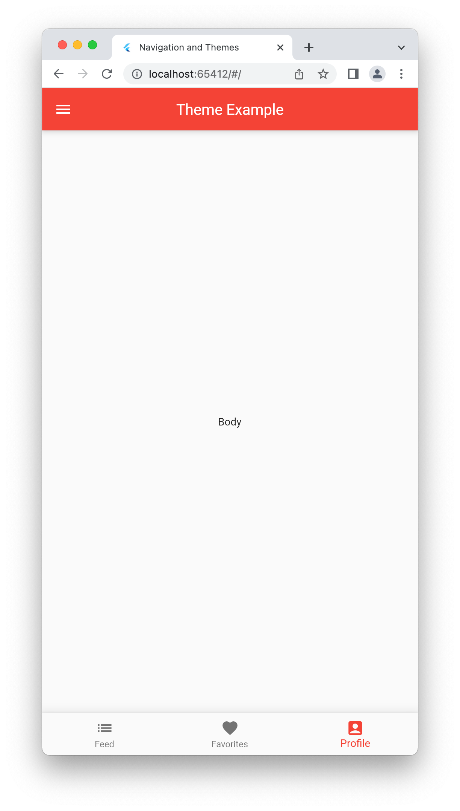

## Navegação - Bottom Navigation

Primeiramente iremos navegar entre as páginas do `bottomNavigation`, para tal, precisaremos criar uma lista de páginas pré-estabelecidas para serem alternadas quando os ícones das barra de navegação forem selecionados.

1. Crie uma lista de containeres com um background especidico para diferenciação, os containeres irão representar as páginas do App inicialmente. Atualize seu código, acima do método build de `HomePage` adicione a lista de widgets abaixo.

```dart
var pages = [
    Container(
      color: Colors.green,
    ),
    Container(
      color: Colors.orange,
    ),
    Container(
      color: Colors.pink,
    ),
  ];
```

2. Adicione a propriedade `onTap: ` no `bottomNavigationBar`. Este trecho irá alterar a página selecionada com base no estado `_selectedIndex`.

```dart
      bottomNavigationBar: BottomNavigationBar(
        onTap: (index) {
          setState(() {
            _selectedIndex = index;
          });
        },
```
3. Substitua a propriedade `body: ` por um `IdexedStack`, este widget nos auxiliará com a permanencia dos estados dos componentes quando as páginas forem alteradas.

```dart
      body: IndexedStack(
        index: _selectedIndex,
        children: pages,
      ),
```

4. Teste a navegação e valide o comportamento da `bottomNavigationBar`.

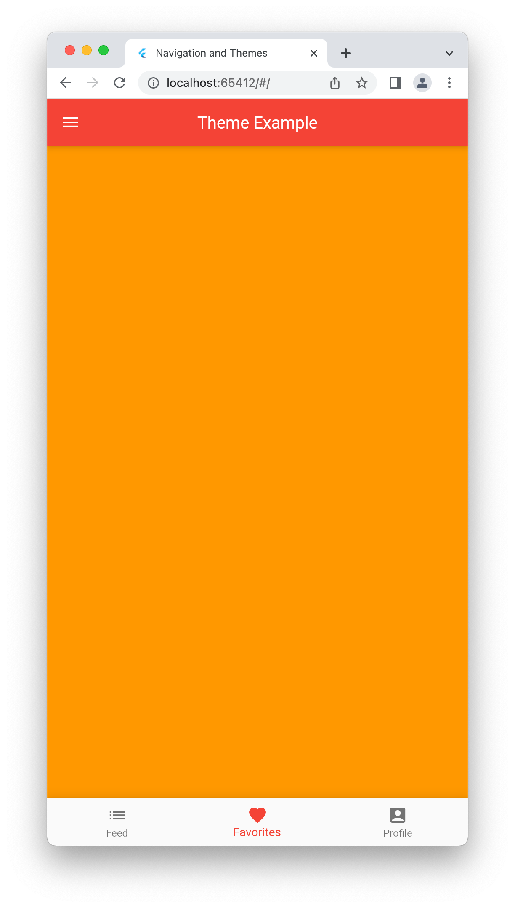

> Já utilizamos a navegação de forma semelhante utilizando `Tabs` no app `About Me`.

> Confira o código completo

```dart
import 'package:flutter/material.dart';

class HomePage extends StatefulWidget {
  const HomePage({super.key});

  @override
  State<HomePage> createState() => _HomePageState();
}

class _HomePageState extends State<HomePage> {
  final url =
      'https://images.pexels.com/photos/1674752/pexels-photo-1674752.jpeg?auto=compress&cs=tinysrgb&w=1260&h=750&dpr=2';

  int _selectedIndex = 0;

  var pages = [
    Container(
      color: Colors.green,
    ),
    Container(
      color: Colors.orange,
    ),
    Container(
      color: Colors.pink,
    ),
  ];

  @override
  Widget build(BuildContext context) {
    return Scaffold(
      appBar: AppBar(
        title: const Text('Theme Example'),
      ),
      drawer: SafeArea(
        child: Drawer(
            child: ListView(
          children: [
            UserAccountsDrawerHeader(
              currentAccountPicture:
                  CircleAvatar(backgroundImage: NetworkImage(url)),
              accountName: const Text('Aluno Fatec Araras'),
              accountEmail: const Text('aluno@fatec.sp.gov.br'),
            ),
            ListTile(
              onTap: () {},
              leading: const Icon(Icons.exit_to_app),
              title: const Text('Logout'),
            )
          ],
        )),
      ),
      body: IndexedStack(
        index: _selectedIndex,
        children: pages,
      ),
      bottomNavigationBar: BottomNavigationBar(
        onTap: (index) {
          setState(() {
            _selectedIndex = index;
          });
        },
        currentIndex: _selectedIndex,
        items: const [
          BottomNavigationBarItem(
            icon: Icon(Icons.list),
            label: 'Feed',
          ),
          BottomNavigationBarItem(
            icon: Icon(Icons.favorite),
            label: 'Favorites',
          ),
          BottomNavigationBarItem(
            icon: Icon(Icons.account_box),
            label: 'Profile',
          ),
        ],
      ),
    );
  }
}

```

## Navegação - Stack
 
Iremos realizar a navegação entre telas sem o uso de componentes especiais como Tabs e Bottom Navigation, iremos utilizar rotas próprias de navegação podendo utilizar passagem de dados na navegação.

Iremos criar um feed de artigos com uma lista reduzida de detalhes e navegar para uma página de deetalhes exibindo as informações completas, neste fluxo ao selecionarmos um artigo na lista, iremos passar um objeto para a página de detalhes. Mas antes iremos criar um mock da tela de detalhes.

### Criando Mocks de dados dinamicamente
 
Inclua a depencia `Faker` para criarmos os dados dinamicamente. 

1. Execute o comando abaixo no interpretador de comandos de seu S.O.

```shell
flutter pub add faker
```

2. Crie a model class para manter os dados do Feed; adicione o arquivo `model/feed_model.dart`.

```dart
import 'package:faker/faker.dart';

class Feed {
  final String title;
  final String subtitle;
  final String imageUrl;

  Feed(this.title, this.subtitle, this.imageUrl);

  Feed.fromFaker(Faker faker)
      : title = faker.conference.name(),
        subtitle = faker.lorem.sentences(10).join().replaceAll('.', '. '),
        imageUrl = faker.image.image(random: true, keywords: ['programming']);
}
```

Em especial nesta clase, criamos o construtor nomeado `.fromFaker()`, ele recebe um objeto Faker, o faker irá nos forncer os dados para preencher as informações `mockadas`para exibição. 

**Criar a lista de Artigos para exibir o Feed. Precisaremos substituir páginas atual do Feed, o container verde por um Feed.**

#### Criar o Feed Widget

1. Crie o arquivo `home/widgets/feed_widget.dart` e inclua o trecho abaixo.

```dart
import 'package:f290_acf_navegacao_e_temas/model/feed_model.dart';
import 'package:faker/faker.dart';
import 'package:flutter/material.dart';

class FeedWidget extends StatelessWidget {
  const FeedWidget({super.key});

  @override
  Widget build(BuildContext context) {
    return Padding(
      padding: const EdgeInsets.all(16),
      child: ListView(children: createList(context)),
    );
  }

  List<Widget> createList(BuildContext context) {
    // Gerar lista de Widgets com 20 elementos
    return List.generate(20, (index) {

      // Gerar um objeto da nossa model class a partir do Faker()
      final feed = Feed.fromFaker(faker);

      // Gerar Card com os dados a partir do objeto feed
      return Card(
        child: ListTile(          
          leading: Image.network(feed.imageUrl),
          title: Text(
            feed.title,
          ),
          subtitle:
              Text(feed.subtitle, maxLines: 1, overflow: TextOverflow.ellipsis),
        ),
      );
    });
  }
}
```

2. Substitua a primera pagina do `IndexedStack`no body da `HomePage`.

```dart
  var pages = [
    const FeedWidget(),
    Container(
      color: Colors.orange,
    ),
    Container(
      color: Colors.pink,
    ),
  ];
```

3. Teste o Feed.

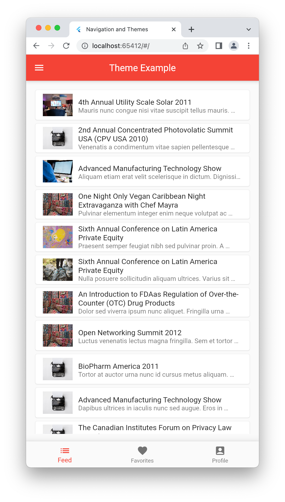

### Navegação

1. Crie uma página de detalhamento para realizarmos a navegação no arquivo `pages/detail/detail_page.dart`. Nesta página iremos utilizar o widget `Placeholder` para esboçar a tela de detalhes durante a navegação.

```dart
import 'package:flutter/material.dart';

class DetailWidget extends StatelessWidget {
  const DetailWidget({super.key});

  @override
  Widget build(BuildContext context) {
    return Scaffold(
      appBar: AppBar(title: const Text('Detail Page')),
      body: Padding(
        padding: const EdgeInsets.all(16),
        child: Column(
          children: const [
            Placeholder(
              fallbackHeight: 200,
            ),
            Padding(
              padding: EdgeInsets.symmetric(vertical: 24),
              child: Placeholder(
                fallbackHeight: 50,
              ),
            ),
            Placeholder(),
          ],
        ),
      ),
    );
  }
}
```

2. Adicione o evento de navegação ao `ListTile` para realizarmos a navegação. 

```dart
child: ListTile(
    onTap: () {
      Navigator.push(
        context,
        MaterialPageRoute(
          builder: ((context) => const DetailWidget()),
        ),
      );
    },
```

> O Navigator pussui o métdodo push(), o push adiciona uma nova tela à pilha de exibição; MaterialPageRoute faz a interposição das páginas, após sua execução o DetailWidget() está empilhado acima da HomePage().

3. Teste a navegação.

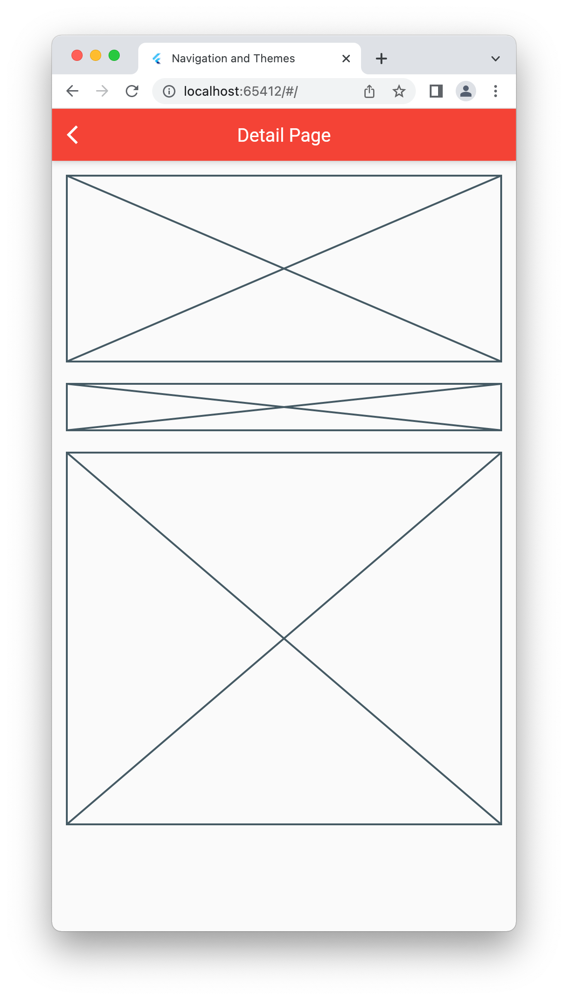

4. Altere a `DetailPage` parq que ela receba um objeto Feed para exibir os dados so Artigo substituindo os PlaceHolders.

```dart
import 'package:f290_acf_navegacao_e_temas/model/feed_model.dart';
import 'package:flutter/material.dart';

class DetailWidget extends StatelessWidget {
  const DetailWidget({super.key, required this.feed});

  final Feed feed;

  @override
  Widget build(BuildContext context) {
    return Scaffold(
      appBar: AppBar(title: const Text('Detail Page')),
      body: SingleChildScrollView(
        child: Column(
          children: [
            Image.network(
              feed.imageUrl,
              height: 300,
              fit: BoxFit.cover,
            ),
            Padding(
              padding: const EdgeInsets.all(16.0),
              child: Text(
                feed.title,
                style:
                    const TextStyle(fontSize: 24, fontWeight: FontWeight.bold),
              ),
            ),
            Padding(
              padding: const EdgeInsets.all(16.0),
              child: Text(
                feed.subtitle,
                style: const TextStyle(
                  fontSize: 24,
                ),
                textAlign: TextAlign.justify,
              ),
            ),
          ],
        ),
      ),
    );
  }
}

```

5. Teste a navegação.

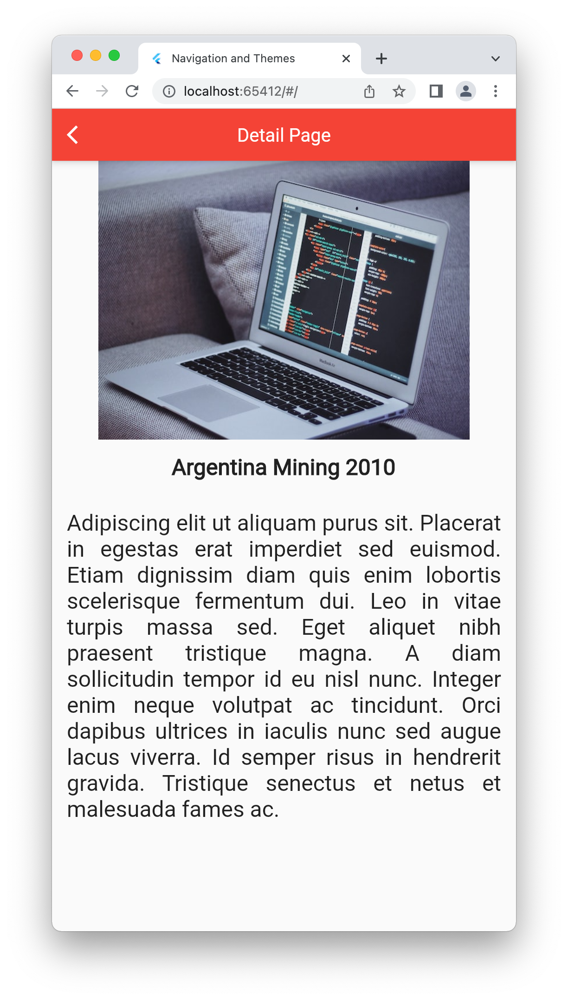

### Navegação Concluída

# Temas

## Tema Claro

Nosso app já possui o tema vermelho configurado pelo Material Design. 

> Faça modificações em seu tema

1. Altere a cor primária do tema do App.

```dart
class MyApp extends StatelessWidget {
  const MyApp({super.key});

  @override
  Widget build(BuildContext context) {
    return MaterialApp(
      // Altere para sua cor favorita
      theme: ThemeData(primarySwatch: Colors.amber),
      debugShowCheckedModeBanner: false,
      title: 'Navigation and Themes',
      home: HomePage(),
      routes: {},
    );
  }
}
```

2. Teste a modificação

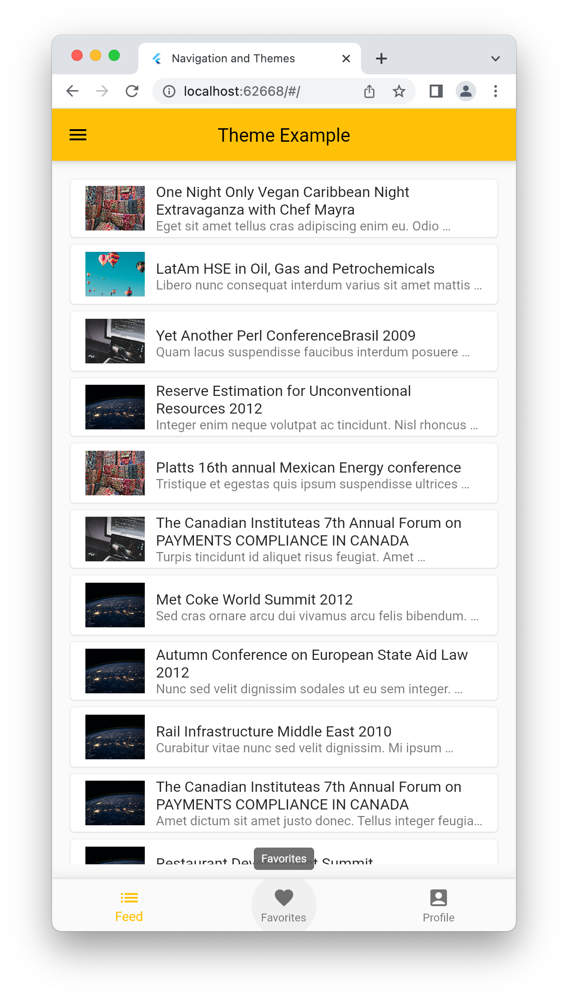

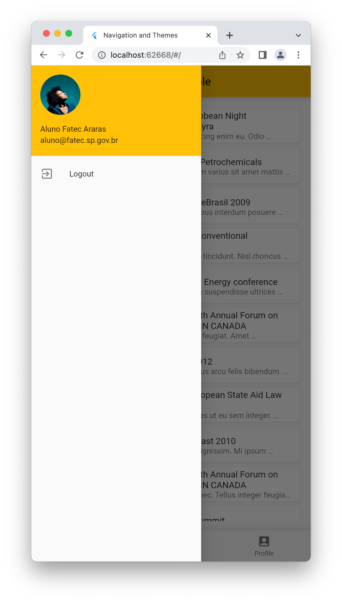

3. Adicione uma cor secundária ao seu tema; utilize as cores verde e vermelha no arquivo `main.dart`.

```dart
class MyApp extends StatelessWidget {
  const MyApp({super.key});

  @override
  Widget build(BuildContext context) {
    return MaterialApp(
      theme: ThemeData.light().copyWith(
        colorScheme: const ColorScheme.light(
          primary: Colors.green,
          secondary: Colors.red,
        ),
      ),
      debugShowCheckedModeBanner: false,
      title: 'Navigation and Themes',
      home: HomePage(),
      routes: {},
    );
  }
}
```

> O construtor nomeado copyWith copia todos os atributos de um tema existente e você pode alterar apenas as propriedades de seu interesse; neste caso mantemos todas as caracteristicas do tema claro e alteramos apenas as cores primaria e secundária.

4. Adicione um FAB para testar a cor secondária. Adicione o trecho abaixo da propriedade `body`.

```dart
floatingActionButton: FloatingActionButton(
  onPressed: () {},
  child: const Icon(
    Icons.favorite,
  ),
),
```

5. Teste o tema.

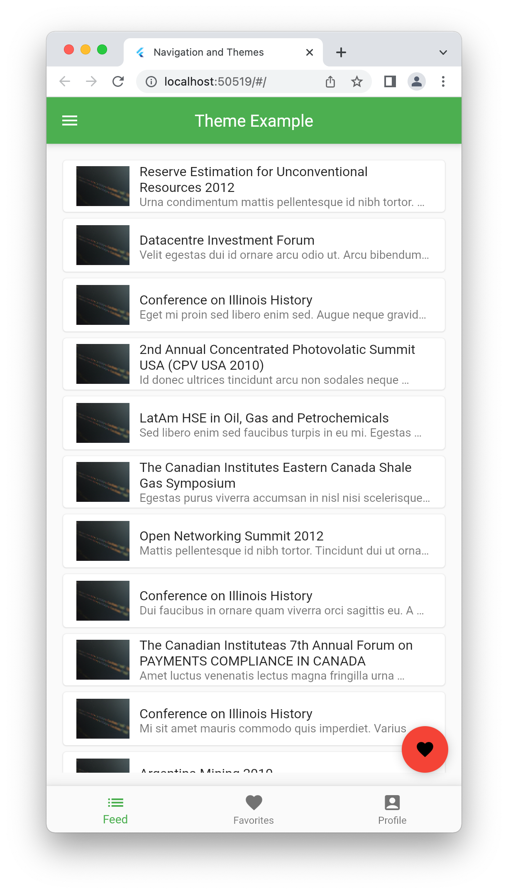

Concluímos o tema claro!

## Tema Escuro

O tema escuro tem suas caraterísticas próprias como o padrão de cores com baixa saturação, iremos criar o tema escuro com base no vermelho com o tom 200 do Material Color.

Como teremos 2 temas, um claro e um escuro que podem ser alterados pelo sistema operacional; iremos informar os 2 temas no `MaterialApp`.

### Criando os temas

1. Crie o arquivo `themes/theme.dart` e inclua o código abaixo.

```dart
import 'package:flutter/material.dart';

class AppTheme {
  // Atributos estáticos de cores para o tema claro
  static const lightColorPrimary = Colors.green;
  static const lightColorSecondary = Colors.red;

  // Criação do ThemeData do tema claro
  static final lightTheme = ThemeData.light().copyWith(
    colorScheme: const ColorScheme.light(
      primary: lightColorPrimary,
      secondary: lightColorSecondary,
    ),
  );

// Atributos estáticos de cores para o tema escuro
  static final darkColor = Colors.red.shade200;

  // Criação do ThemeData do tema escuro
  static final darkTheme = ThemeData.dark().copyWith(
    colorScheme: ColorScheme.dark(
      surface: Colors.white.withAlpha(12),
      background: Colors.black12,
      secondary: darkColor,
    ),

    // Configuracões específicas para componentes que não herdarem as cores do tema
    iconTheme: IconThemeData(color: darkColor),
    buttonTheme: ButtonThemeData(buttonColor: darkColor),
  );
}
```

> Note que acima, nós copiamos o tema escuro e alteramos alguma propriedades específicas para facilitar a configuração completa da propriedade colorScheme, por exemplo.

2. Inclua os temas no `MaterialApp`.

```dart
// Importação dos Temas
import 'package:f290_acf_navegacao_e_temas/themes/themes.dart';
import 'package:flutter/material.dart';

void main() {
  runApp(const MyApp());
}

class MyApp extends StatelessWidget {
  const MyApp({super.key});

  @override
  Widget build(BuildContext context) {
    return MaterialApp(
      // Temas claro e escuro adicionados
      theme: AppTheme.lightTheme,
      darkTheme: AppTheme.darkTheme,
      debugShowCheckedModeBanner: false,
      title: 'Navigation and Themes',
      home: HomePage(),
      routes: {},
    );
  }
}
```
3. Teste o tema escuro.

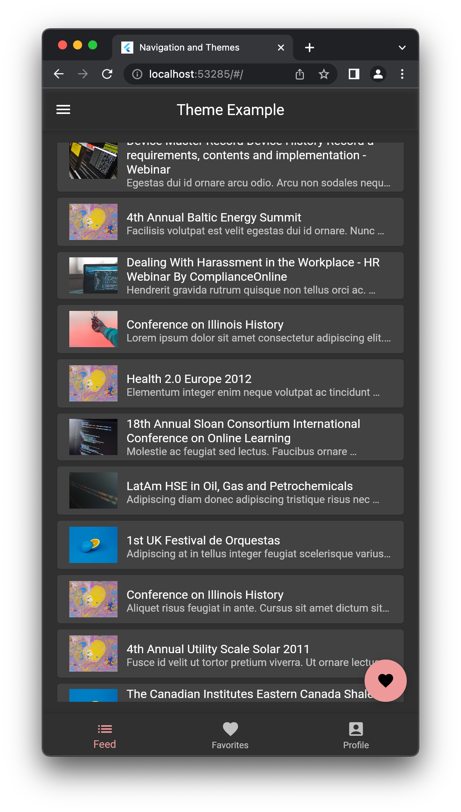

> Para testar o tema escuro; altere o tema de claro para escuro em seu sistema operacioal.

#### Alterando as fontes do seu tema

Vamos altarar as fontes do App, para tal utilizaremos o package `GoogleFonts`.

1. Execute o comando abaixo para incluir o pacote.

```shell
flutter pub add google_fonts
```

2. Altere a classe `AppTheme`.

```dart
import 'package:flutter/material.dart';
import 'package:google_fonts/google_fonts.dart';

class AppTheme {
  // Atributos estáticos de cores para o tema claro
  static const lightColorPrimary = Colors.green;
  static const lightColorSecondary = Colors.red;

  // Criação do tema padrão utilizando fontes customizadas para o HeadLine4 e bodyText1
  static var textTheme = TextTheme(
    headline4: GoogleFonts.raleway(fontSize: 36),
    bodyText1: GoogleFonts.libreBaskerville(fontSize: 20),
  );

  // Criação do ThemeData do tema claro
  static final lightTheme = ThemeData.light().copyWith(
    textTheme: textTheme,
    colorScheme: const ColorScheme.light(
      primary: lightColorPrimary,
      secondary: lightColorSecondary,
    ),
  );

// Atributos estáticos de cores para o tema escuro
  static final darkColor = Colors.green.shade200;

  // Criação do ThemeData do tema escuro
  static final darkTheme = ThemeData(
    // Alteração do brightness do tema, removemos o copyWith()
    brightness: Brightness.dark,
    textTheme: textTheme,
    colorScheme: ColorScheme.dark(
      surface: Colors.white.withAlpha(12),
      background: Colors.black12,
      secondary: darkColor,
    ),
    iconTheme: IconThemeData(color: darkColor),
    buttonTheme: ButtonThemeData(buttonColor: darkColor),
  );
}
```

> Maiores informações sobre temas neste [link](https://docs.flutter.dev/cookbook/design/themes).


3. Altere a página de detalhes para que ela utilize o tema criado.

```dart
import 'package:f290_acf_navegacao_e_temas/model/feed_model.dart';
import 'package:flutter/material.dart';

class DetailWidget extends StatelessWidget {
  const DetailWidget({super.key, required this.feed});

  final Feed feed;

  @override
  Widget build(BuildContext context) {
    return Scaffold(
      appBar: AppBar(title: const Text('Detail Page')),
      body: SingleChildScrollView(
        child: Column(
          children: [
            Image.network(
              feed.imageUrl,
              height: 300,
              fit: BoxFit.cover,
            ),
            Padding(
              padding: const EdgeInsets.all(16.0),
              child: Text(
                feed.title,
                // Alteramos aqui...
                style: Theme.of(context).textTheme.headline4,
              ),
            ),
            Padding(
              padding: const EdgeInsets.all(16.0),
              child: Text(
                feed.subtitle,
                // E aqui...
                style: Theme.of(context).textTheme.bodyText1,
                textAlign: TextAlign.justify,
              ),
            ),
          ],
        ),
      ),
    );
  }
}

```

4. Teste o App.

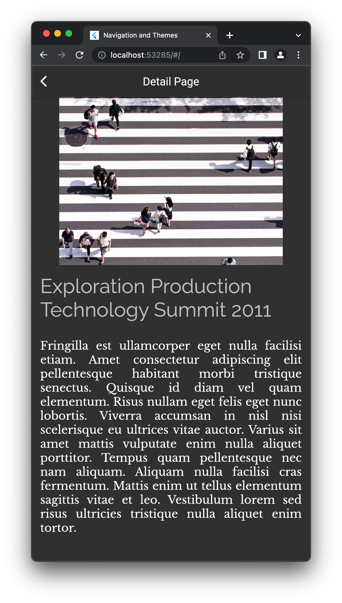
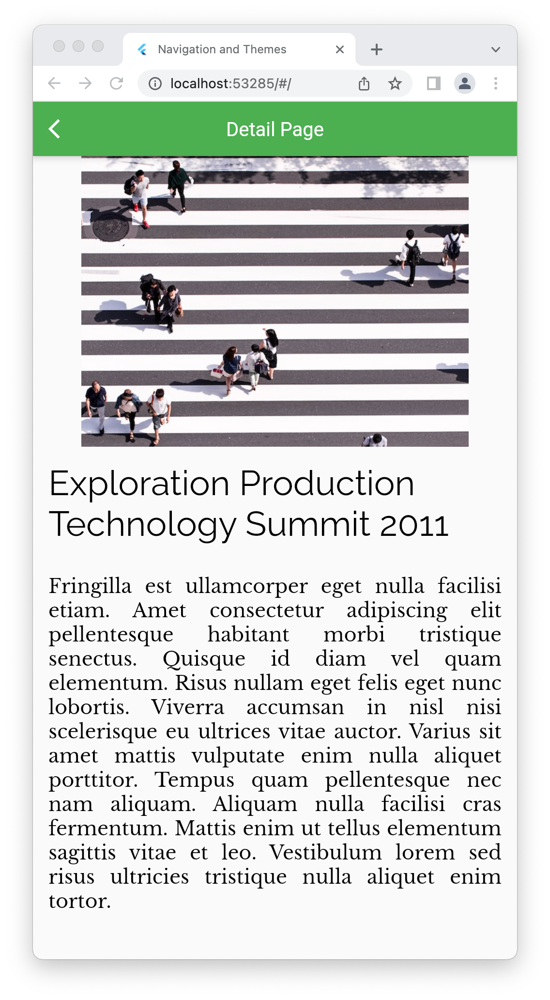

# Concluímos os temas e a navegação

> Para os alunos que não tenham conseguido configurar o ambiente ou o sistema operacional; temos duas opções: primeiro ao invés de informar os 2 temas no MaterialApp, informe apenas o tema claro ou tema escuro; segundo utilize o trecho abaixo para testar dinamicamente a mudança de temas pelo htts://dartpad.dev

```dart
import 'package:flutter/material.dart';

void main() {
  runApp(MyApp());
}

class MyApp extends StatefulWidget {
  @override
  State<MyApp> createState() => _MyAppState();
}

class _MyAppState extends State<MyApp> {
  final light = ThemeData(primarySwatch: Colors.deepOrange);

  final dark = ThemeData.dark().copyWith(
      colorScheme: const ColorScheme.dark().copyWith(
        surface: Colors.white12,
        secondary: Colors.purple.shade200,
      ),
      switchTheme: SwitchThemeData(
        thumbColor: MaterialStateProperty.resolveWith<Color>((state) {
          if (state.contains(MaterialState.selected)) {
            return Colors.purple.shade200;
          } else {
            return Colors.white;
          }
        }),
        trackColor: MaterialStateProperty.resolveWith<Color>((state) {
          if (state.contains(MaterialState.selected)) {
            return Colors.purple.shade300;
          } else {
            return Colors.purple.shade100;
          }
        }),
      ));

  var isLightTheme = true;
  IconData icon = Icons.light_mode;

  var _swicth = true;

  @override
  Widget build(BuildContext context) {
    return MaterialApp(
      theme: isLightTheme ? light : dark,
      debugShowCheckedModeBanner: false,
      home: Scaffold(
        appBar: AppBar(
          title: const Text('Themes'),
          actions: [
            IconButton(
                onPressed: () {
                  setState(() {
                    isLightTheme = !isLightTheme;
                    icon = isLightTheme ? Icons.light_mode : Icons.dark_mode;
                  });
                },
                icon: Icon(icon))
          ],
        ),
        body: _buildComponents(),
        floatingActionButton: FloatingActionButton(
          onPressed: () {
            Navigator.push(
              context,
              MaterialPageRoute(builder: (context) => const SecondRoute()),
            );
          },
          child: const Icon(Icons.add),
        ),
      ),
    );
  }

  _buildComponents() {
    return Column(
      mainAxisAlignment: MainAxisAlignment.center,
      children: [
        const Padding(
          padding: EdgeInsets.symmetric(horizontal: 16, vertical: 8),
          child: TextField(
            decoration: InputDecoration(
              filled: true,
              labelText: 'E-mail',
              helperText: 'E-mail valido, por favor',
            ),
          ),
        ),
        const Padding(
          padding: EdgeInsets.symmetric(vertical: 8, horizontal: 16),
          child: Text('Lorem ipsum dolor sit amet.'),
        ),
        Padding(
          padding: const EdgeInsets.symmetric(vertical: 8, horizontal: 16),
          child: ElevatedButton(
            onPressed: () {},
            child: const Text('ElevatedButton'),
          ),
        ),
        Padding(
          padding: const EdgeInsets.symmetric(vertical: 8, horizontal: 16),
          child: OutlinedButton(
            onPressed: () {},
            child: const Text('OutlinedButton'),
          ),
        ),
        Padding(
          padding: const EdgeInsets.symmetric(vertical: 8, horizontal: 16),
          child: TextButton(
            onPressed: () {},
            child: const Text('TextButton'),
          ),
        ),
        Padding(
          padding: const EdgeInsets.symmetric(vertical: 8, horizontal: 16),
          child: IconButton(onPressed: () {}, icon: Icon(icon)),
        ),
        SwitchListTile(
          title: const Text('Modo DEV'),
          value: _swicth,
          onChanged: (bool value) {
            setState(() {
              _swicth = value;
            });
          },
        )
      ],
    );
  }
}
```

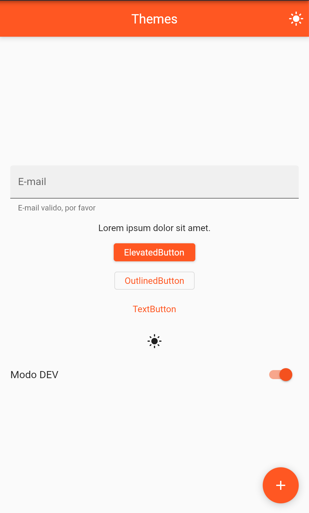
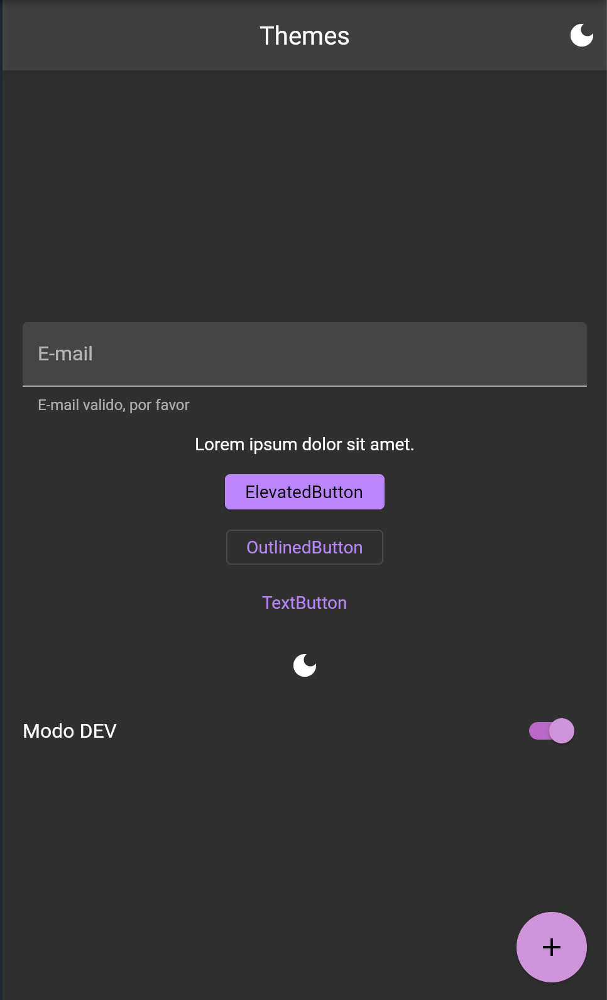
